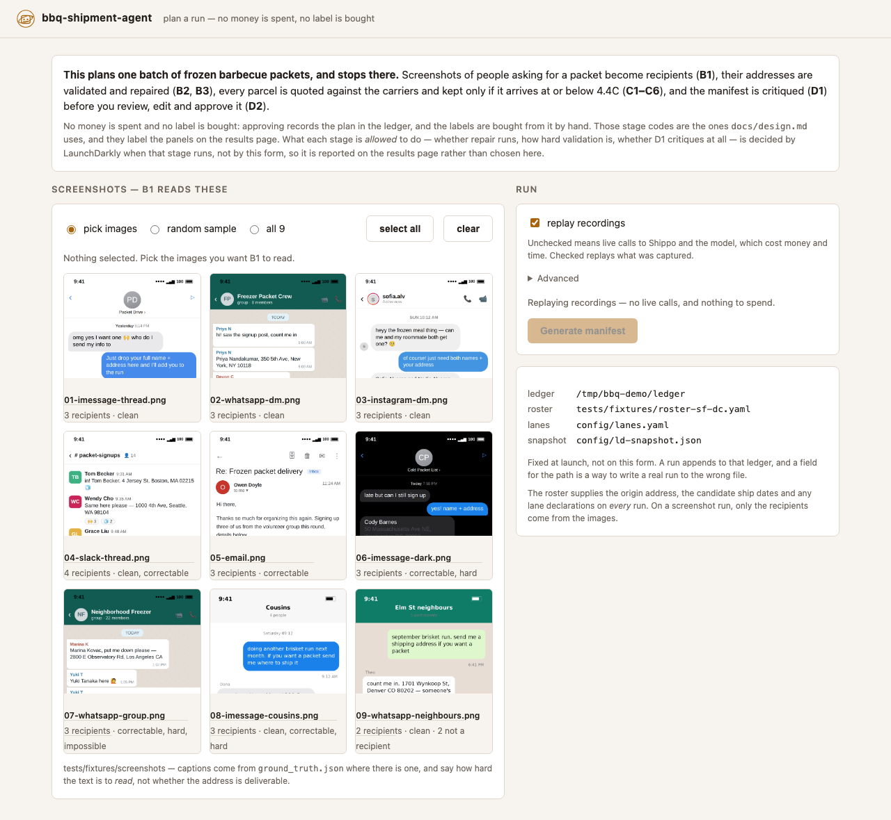
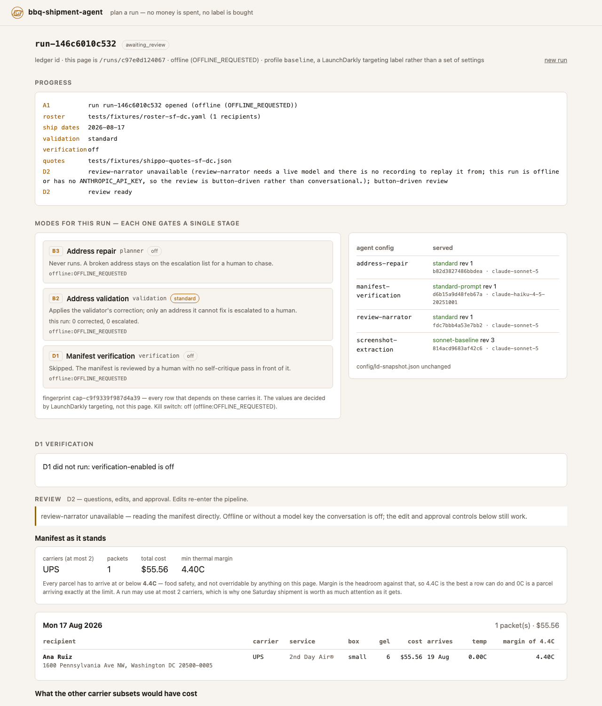

# bbq-shipment-agent

Plans the assembly and shipment of frozen barbecue packets to a recipient list,
producing a reviewable work package that a human approves. It spends no money
and buys no labels — the operator does that by hand from an approved manifest.

Full design: [`docs/design.md`](docs/design.md). Working notes: [`CLAUDE.md`](CLAUDE.md).

<picture>
  <source media="(prefers-color-scheme: dark)" srcset="docs/img/ui-setup-dark.png">
  
</picture>

Picking which screenshots B1 reads is the one thing a terminal cannot do, and
the reason the web UI exists at all.

## Setup

Python 3.12 or newer. Nothing below needs an API key — every step runs against
committed fixtures.

```bash
git clone https://github.com/jeremy-m-mcgee/bbq-shipment-agent.git
cd bbq-shipment-agent
```

Then pick an installer. **uv is the supported one**: `uv.lock` is committed, so
it is the only path that installs the exact versions this project is tested
against. The other two resolve their own and are documented because they work,
not because they are equivalent.

Install [uv](https://docs.astral.sh/uv/getting-started/installation/), which
also fetches Python 3.12 for you if you do not have it.

```bash
# Verify the install. About eight seconds. `uv run` installs from uv.lock on
# first use, so there is no separate `uv sync` step and no venv to activate.
uv run pytest

# See a real manifest, spending nothing.
uv run bbq-shipment-agent run plan --offline \
  --recipients tests/fixtures/roster-sf-dc.yaml \
  --quotes tests/fixtures/shippo-quotes-sf-dc.json \
  --validations tests/fixtures/shippo-addresses.json \
  --completions tests/fixtures/d1-completions.json \
  --ledger /tmp/scratch
```

On pip or poetry the two commands above are the same; what changes is how you
get there and what you type in front of them — here and everywhere else in this
README.

| installer | install step | prefix |
|---|---|---|
| **uv** — supported | none, `uv run` installs from `uv.lock` on first use | `uv run` |
| pip + venv | `python3.12 -m venv .venv`, activate it, then `pip install -e . pytest httpx` | none, once the venv is active |
| poetry 2.0+ | `poetry install`, which installs the dev group too | `poetry run` |

Three things the table cannot hold. **pip** needs a Python 3.12 interpreter
already on the machine — it will not fetch one — the Windows activate path is
`.venv\Scripts\activate`, and `pytest httpx` is the dev group spelled out
because pip only reads it as `--group dev` on 25.1+. **Poetry** must be 2.0 or
newer to read the PEP 621 `[project]` table this repo uses, and `poetry install`
writes a `poetry.lock` of its own resolution, gitignored deliberately: `uv.lock`
is this project's lock, and a second one in the tree would be a second answer to
the same question. And on **both**, `UV_ENV_FILE` does nothing — see the note
under [Load the keys](#load-the-keys--do-this-once-per-shell).

Whichever you picked, that plan is the whole system on recorded inputs:
LaunchDarkly served from `config/ld-snapshot.json`, Shippo and the model from
the fixtures. See [Offline and replay](#offline-and-replay) for what each
recording covers and where the replayed path stops.

### Then, for live runs: keys

```bash
cp .env.example .env        # then fill in LD_SDK_KEY, ANTHROPIC_API_KEY, SHIPPO_API_KEY
cp recipients.example.yaml recipients.yaml
```

`.env.example` says what each key is for, which of them are optional, and what
happens without them. `recipients.yaml` is gitignored because it holds home
addresses.

### Load the keys — do this once per shell

```bash
export UV_ENV_FILE=$PWD/.env
```

**Nothing that touches a key works without this.** `uv run` reads `.env` only
when `UV_ENV_FILE` points at it. `.devcontainer/devcontainer.json` sets it via
`remoteEnv`, but plenty of shells never see that — a new terminal, a
non-interactive shell, `nohup`, a task runner. Skip it and every key reads as
empty: LaunchDarkly quietly falls back to the per-capability code defaults
(planner off, validation standard, verification off), while Shippo and
Anthropic fail outright.

Confirm it took:

```bash
uv run python -c "import os; print({k: bool(os.environ.get(k)) for k in ('LD_SDK_KEY','ANTHROPIC_API_KEY','SHIPPO_API_KEY')})"
# {'LD_SDK_KEY': True, 'ANTHROPIC_API_KEY': True, 'SHIPPO_API_KEY': True}
```

Three `False` values mean the file was not loaded, not that the keys are
missing. If you would rather not export, prefix each command instead:
`UV_ENV_FILE=$PWD/.env uv run ...`.

**On pip or poetry, `UV_ENV_FILE` does nothing** — it is a uv setting, and
nothing in the package reads `.env` for itself. Source it into the environment
instead, which the same confirmation command then checks:

```bash
set -a; source .env; set +a
```


## Commands

Run these from the repo root. Everything but the `ledger` subcommands is live
by default, so they want a shell where the export above has been done.

```bash
uv run bbq-shipment-agent run init      # A1 only: open a run, snapshot AI Configs
uv run bbq-shipment-agent run extract   # A1 and B1 only: read screenshots, print what was found
uv run bbq-shipment-agent run plan      # A1 -> B -> C -> D1, prints a verified manifest
uv run bbq-shipment-agent run review    # the above, then the D2 conversation
uv run bbq-shipment-agent ui            # the same thing in a browser, with a screenshot picker
uv run bbq-shipment-agent drive         # fire runs at a running `ui`, one every 30s
uv run bbq-shipment-agent ledger verify # parse every JSONL line, no database
uv run bbq-shipment-agent ledger rebuild
uv run bbq-shipment-agent ledger tools  # tools offered and called, folded by run
```

`run plan`, `run review` and `ui` all default `--ledger` to the committed
`ledger/`, so a trial run appends a real row to it. Point them at
`--ledger /tmp/scratch` while you are experimenting. Paths are relative to the
working directory, so the repo root is also where `recipients.yaml`,
`config/` and `tests/fixtures/screenshots` resolve from.

## The web UI

```bash
export UV_ENV_FILE=$PWD/.env                                    # once per shell
uv run bbq-shipment-agent ui --ledger /tmp/ui-ledger            # http://127.0.0.1:8765
```

Both parts of that matter, and the UI is where forgetting either one hurts
most:

- **Without `UV_ENV_FILE`** the server starts perfectly and the page renders,
  and you only find out there are no keys after picking images and clicking.
  It now says so at launch and in a banner next to the button — but the fix is
  to load the file.
- **Without `--ledger`** a trial run appends to the committed `ledger/`. A
  button feels cheaper to press than a command is to type, and the append is
  just as real.

**A live run costs real calls**: one vision call per selected screenshot, plus
a Shippo validation per address and a few hundred rate quotes. The picker
therefore starts with **nothing selected** and the button disabled, and it
shows the call count as you tick — because the number you are about to spend
should be on screen before you press it, not in a log afterwards.

Pick which screenshots B1 reads by looking at them, then generate a manifest.
That is the one thing a terminal cannot do: `--screenshot-count 3` takes three
of them and prints which three, but you cannot *choose* three without seeing
them. The picker captions each image from `ground_truth.json` where there is
one — how many recipients it holds, and how hard they are to read — so you can
aim a run at the awkward cases rather than sampling blind.

### The results page

<picture>
  <source media="(prefers-color-scheme: dark)" srcset="docs/img/ui-results-dark.png">
  
</picture>

Three things on that page are worth pointing at, because they are the design
rather than the decoration:

- **Every mode says which stage it gated and what it actually did**, not just
  its value. `off` is reported as a normal outcome — "never runs, a broken
  address stays on the escalation list" — because a capability being off is a
  configuration, not a degradation.
- **The values were decided by LaunchDarkly when each stage ran**, and the page
  says so rather than offering a control. The form configures a run; it does
  not configure the system. The `4.4C` limit and the two-carrier cap appear as
  stated policy for the same reason — neither is the operator's to move.
- **The agent config table names the variation and model that served each
  stage**, which is what makes a surprising run diagnosable months later
  against the committed ledger.

The screenshots above are a **replayed** run against committed fixtures — no
keys, no network, nothing spent. That is also why D1 reads *did not run*: the
offline gate serves the code default, and `verification-enabled` defaults off.

The page shows what the CLI prints, in the shape it should have been in all
along: the capability header and the served AI Configs stay at the top instead
of scrolling past, the manifest is grouped by ship date, and the runner-up
carrier pairs sit beside the chosen one. Stage progress streams while the run
goes, because a real run makes a vision call per image and a few hundred rate
quotes.

It no longer stops where `run plan` stops. A run that produces a covering
manifest parks in `awaiting_review`, and the review is a pane beside the
manifest rather than a second one: ask the narrator a question, pin or exclude
a recipient, and approve or reject. An edit re-solves and re-renders in place,
and approval writes the ledger from the browser. Section 4's edit-handling
table stays in Python — the routes only carry the operator's move to
`ReviewSession`. A parked review holds the run slot until it reaches a terminal
state, so a second run cannot append to the same ledger underneath it.

What the form still does *not* offer is a control for the 4.4C threshold, the
carrier cap or the kill switch, because the first two are Python constants and
the third is a LaunchDarkly flag. The form configures a run, not the system.

It binds `127.0.0.1` with no host option and has no authentication. That is the
trade: nothing off this machine can reach it, and it serves real home addresses
and screenshots of people's private messages.

To drive it without spending anything — no keys needed at all, so the export
above is irrelevant here — launch it with the recordings:

```bash
uv run bbq-shipment-agent ui --offline --ledger /tmp/ui-ledger \
  --recipients tests/fixtures/roster-sf-dc.yaml \
  --quotes tests/fixtures/shippo-quotes-sf-dc.json \
  --validations tests/fixtures/shippo-addresses.json \
  --completions tests/fixtures/d1-completions.json \
  --extractions tests/fixtures/b1-extractions.json \
  --repairs tests/fixtures/b3-repairs.json
```

The **replay recordings** checkbox is then on by default; unchecking it makes
the same run live.

One honest limit. `--extractions` and `--repairs` replay B1 and B3 for any
subset of the fixture screenshots — the recording is matched on image content,
so reading two of them replays the right two. But
`shippo-quotes-sf-dc.json` holds one lane, San Francisco to Washington, and the
people in those screenshots live in twenty-odd other places. A replayed
screenshot run therefore gets as far as C2 and stops, because `RecordedQuoter`
refuses to invent a rate it never recorded — which is the behaviour you want.
Fully offline works today for the **roster** path (`--recipients
tests/fixtures/roster-sf-dc.yaml`, then tick "all" with no screenshots).
A *full plan* from screenshots plus recorded quotes needs those lanes recorded
first.

The exception is **depth**. Set the form to `screenshots only` and a replayed
screenshot run is completely offline, because it stops before the quoter that
has one lane. `--extractions` is the only recording it needs.

### Driving it: many runs, over time

`drive` is a client of a UI that is already serving. It posts the same form a
browser posts, so a driven run and a clicked one are the same run — nothing
about the pipeline is reachable from the driver.

```bash
# terminal 1
UV_ENV_FILE=$PWD/.env uv run bbq-shipment-agent ui --screenshots tests/fixtures/screenshots --ledger /tmp/drive-ledger

# terminal 2
uv run bbq-shipment-agent drive --every 30 --runs 20 --vary sample --campaign aug-load --depth extract
```

That starts a run every 30 seconds, each reading a different random subset of
the screenshots. The subset is the point: design 6.6 makes the **image** the
only unit a LaunchDarkly rollout can bucket on in this system, so runs that
differ only in wall-clock time exercise the server and measure nothing.

| what varies | flag |
|---|---|
| a random sample, with the seed printed | `--vary sample` *(default)* |
| a random named subset | `--vary explicit` |
| the whole directory, every time | `--vary all` |
| no images at all, roster only | `--vary roster` |
| the `profile` targeting label, cycled one per run | `--profiles baseline,planner_trial` |
| a numbered campaign on the run context | `--campaign aug-load` |
| where the run stops | `--depth plan\|extract\|mixed` |

**`--depth extract` is the one to drive a B1 rollout at.** It stops each run
after extraction: one vision call per screenshot, no Shippo quote and no D1.
That is the whole cost, it needs no key but `ANTHROPIC_API_KEY`, and B1 is the
only stage a rollout here can bucket on anyway — so a hundred extract-only runs
say more about a prompt than a handful of full plans, for less money. `mixed`
alternates the two.

```bash
uv run bbq-shipment-agent drive --every 30 --depth extract --vary sample
```

Two other ways to reach the same depth: `run extract` on the CLI, and the
**depth** control on the form.

`--every` is a **floor on starts, not a promise**. The app runs one at a time
and refuses the second, so the driver waits for the run in flight and fires
when the interval has elapsed — which for a live screenshot run is usually
later than the interval. The tally at the end says how many were refused.
`--seed` makes a whole session repeatable, and `--replay` uses whatever
recordings the server was launched with, which is the free way to test the
driver rather than the pipeline.

Each of these runs costs real money by default: a vision call per screenshot,
Shippo quotes, and a D1 call. Twenty of them is twenty times that.

### Reviewing a plan, with recipients from screenshots

This is the D2 conversational flow. It plans a run, then opens a conversation
over the manifest where you can ask *why* the plan is what it is.

```bash
UV_ENV_FILE=$PWD/.env uv run bbq-shipment-agent run review --screenshots tests/fixtures/screenshots --screenshot-count 2 --screenshot-seed 1 --ledger /tmp/review-ledger
```

`--screenshots` makes B1 extract the recipients, so `recipients.yaml` supplies
only the origin, the candidate ship dates and any lane declarations.
`--screenshot-count` reads a random sample of that many images and prints both
the sample and its seed; `--screenshot-seed` re-reads the same sample.
`--ledger` points somewhere disposable so a trial approval does not append to
the committed `ledger/`.

At the `>` prompt:

```
approve | reject | exclude <key> | pin <key> <YYYY-MM-DD> | show | quit
```

**Anything else goes to `review-narrator`.** That is the "why" channel:

- Which constraint is doing the most work?
- Why is one shipment $80 and another $18?
- Why does one packet need 6 gel packs and another 4?
- What would we give up by dropping USPS?

Every claim it makes is supposed to trace to a computed field on the manifest.
Design 4 records what happens when one cannot.

## Offline and replay

Nothing in the library opens a socket — `wiring.py` is the only place a live
client is built, and both front-ends go through it. To run without touching
Shippo, LaunchDarkly or a model:

```bash
uv run bbq-shipment-agent run plan --offline \
  --recipients tests/fixtures/roster-sf-dc.yaml \
  --quotes tests/fixtures/shippo-quotes-sf-dc.json \
  --validations tests/fixtures/shippo-addresses.json \
  --completions tests/fixtures/d1-completions.json \
  --ledger /tmp/scratch
```

**`--recipients` is not optional here**, and neither is `--ledger`. The
recordings hold one lane, San Francisco to Washington; the default
`recipients.yaml` — copied from `recipients.example.yaml` — has recipients in
Chicago and Houston, and the run stops on the first of them with
`no recorded validation for ...`. That is `RecordedQuoter` and
`RecordedAddressValidator` refusing to invent an answer they never recorded,
which is the behaviour you want; point them at a roster the recordings cover.
`--ledger` keeps a trial run out of the committed `ledger/`.

The other path that replays end to end is extraction, which stops before the
quoter and so never meets that limit:

```bash
uv run bbq-shipment-agent run extract --offline \
  --screenshots tests/fixtures/screenshots --screenshot-count 2 --screenshot-seed 1 \
  --extractions tests/fixtures/b1-extractions.json \
  --recipients tests/fixtures/roster-sf-dc.yaml \
  --ledger /tmp/scratch
```

Recording another lane is the same task as recording B3's proposed addresses,
noted in design 10. Until that is done, those two are the replayed paths that
work end to end.

## Layout

| path | what |
|---|---|
| `src/bbq_shipment_agent/plan.py` | the spine: A1 → B2 → B4 → C1–C6 → D1 |
| `src/bbq_shipment_agent/wiring.py` | `RunOptions` and the only place a live client is built |
| `src/bbq_shipment_agent/ui/` | the local web app: routes, worker thread, view model, templates |
| `src/bbq_shipment_agent/recipients/` | phase B — extraction, validation, repair, dedupe |
| `src/bbq_shipment_agent/planning/` | phase C — catalog, rates, configurations, thermal, solve, manifest |
| `src/bbq_shipment_agent/review.py` | D2 edit handling and terminal states |
| `src/bbq_shipment_agent/agents/` | model seam, tools, D1 verification, D2 narrator |
| `src/bbq_shipment_agent/ledger/` | append-only JSONL, DuckDB rebuild |
| `src/bbq_shipment_agent/capabilities.py` | the capability enums, the flag gate, coercion, the snapshot |
| `config/lanes.yaml` | ambient assumptions per destination band and month |
| `config/operators.yaml` | the user/department pool a run claims to be |
| `config/ld-snapshot.json` | committed AI Config snapshot: audit trail and offline cache |
| `ledger/*.jsonl` | committed source of truth; `ledger.duckdb` is derived |

The capability flags and the kill switch are **not** in `config/`. They live
in LaunchDarkly and are evaluated live, each under its own stage context; there
is no committed capability file. What a run was actually served is recorded in
`ledger/capability_evaluations.jsonl` and folded onto the run row.
