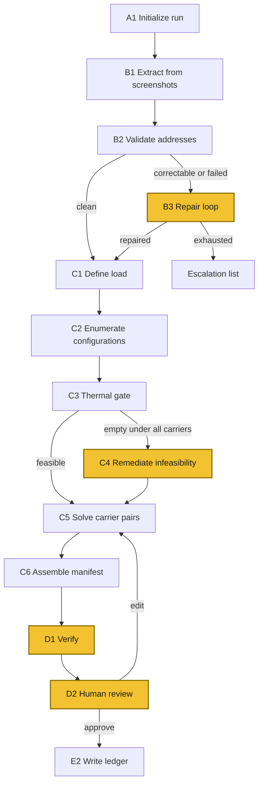

# BBQ Packet Fulfillment System

**Design Document**
Status: Draft
Last updated: 2026-08-01

---

## 1. Purpose

Plan the assembly and shipment of frozen barbecue packets to a recipient list, producing a reviewable work package that a human approves before any money is spent or any label is purchased.

*Plan*, not *execute*. The sentence above always ended at approval, and section 9 removed the dispatch stages that went past it, so the pipeline's last act is recording an approved document. The operator buys the labels.

The system is not an agent that acts on the world unattended. It is a deterministic pipeline with agent loops at four specific points where variance cannot be enumerated in advance.

### Scale

| Dimension | Value |
|---|---|
| Packets per run | ~22 |
| Runs per year | 3 to 5 |
| Product weight | 1.5 lb |
| Box sizes | 2 |
| Gel pack counts | 0 to 6 |
| Candidate ship dates | Saturday, Monday, Tuesday |
| Carriers available | 4 |
| Carriers usable per run | 2 |

The candidate configuration space per shipment is small enough to enumerate exhaustively. No solver or heuristic search is required anywhere in the planning stage.

---

## 2. Design principles

**The spine is deterministic.** Stage sequencing, retries, dedupe, cost ranking, and the thermal gate are ordinary Python. A language model is not in the path of any decision that can be computed.

**Agency is a cost, not a goal.** Model-driven loops exist only where the input space is genuinely open: misread addresses, shipments no configuration can serve, and the tradeoff comparison at review. Everything else stays boring.

- *Explanation is the exception to the cost.* A model that explains a tradeoff carries almost none of the risk of a model that makes a decision, because it sits strictly downstream of a computed result and cannot alter it. The pair solve in C5 produces six candidate plans differing simultaneously across cost, coverage, stranded shipments, thermal margin, and forced-carrier interactions. Reading those differences off a table and holding the interactions in working memory is precisely the comparison humans do badly, especially at the end of a review when attention is thinnest. Narrating it is a legitimate and cheap use of the model, and it needs none of the guardrails that gate the acting loops.

**Capability and authority are different things.** Capability flags (planning, memory, verification) can be toggled freely because the worst case is a weaker proposal in a document being reviewed anyway. Authority flags change what happens in the world if the code is wrong, and are subject to a ceiling that no runtime configuration can raise.

**Every run is reconstructible.** The resolved capability set, the capability overrides the flag layer proposed, and the evaluation reasons are recorded on the run row, and every row that depends on them carries the capability fingerprint pointing back at it. A surprising run must be diagnosable months later, from the committed JSONL and nothing else.

**The system spends no money.** It produces a work package and stops. Label purchase was designed, specified, and then removed (section 9) rather than built, so there is no irreversible action anywhere in the pipeline — the strongest version of "human in the send loop" is a system with no send.

---

## 3. Constraints

### Hard constraints

These are enforced in code and cannot be overridden by flag, CLI argument, or environment variable.

| Constraint | Value | Rationale |
|---|---|---|
| Arrival temperature | at or below 4.4C | Food safety |
| Authority ceiling | `propose_only` | Human in the send loop. Gates nothing today — see 6.5 |
| Carriers per run | at most 2 | Operational simplicity at drop-off |

### Soft constraints

| Constraint | Notes |
|---|---|
| Ship days | Saturday, Monday, Tuesday only |
| Saturday shipments | USPS only for perishables, given weekend ground schedules |
| Refrigerant | Gel packs, not dry ice. Avoids hazmat classification and keeps all four carriers available |

### Structural consequence

Ship dates are chosen per shipment, independently. A single Saturday shipment therefore forces USPS into the carrier pair and leaves exactly one free slot for the remaining 21 shipments. This is the highest-leverage interaction in the planning stage and must be surfaced explicitly rather than buried inside a cost total.

---

## 4. Pipeline



Yellow nodes are model-driven loops. Everything else is deterministic.

### Phase A: Run setup

**A1. Initialize run.**
Generate a run ID. Read the kill switch from repo config and abort if set. Evaluate the flag payload against the run context, clamp `authority-level` against the repo ceiling, and record the resolved capability set plus the proposed overrides on the run record.

Output: run record with capability fingerprint.

### Phase B: Recipient resolution

**B1. Extract.**
Screenshots in, structured recipient records out, via a vision model. Not OCR. Each extracted field carries a confidence value and a provenance pointer back to the source image and region, which B3 depends on.

Model call, single shot. Not an agent loop.

**B2. Validate.**
Each record through Shippo address validation. Three-way outcome: clean, correctable, failed. Gated by `validation-mode`, which decides who adjudicates a *correctable* address: `standard` applies the validator's correction, `strict` escalates it to a human, `off` skips validation entirely.

Runs before C2, and the corrected address is the one that gets quoted. A carrier will happily price a parcel to a mistyped ZIP and return a real rate and transit estimate for the wrong destination, so every cost on a manifest built from unvalidated addresses rests on the operator having typed them correctly. Measured against the live validator, one test address came back with a different 5-digit ZIP — a different neighbourhood and a different lane.

Deterministic. The model-driven stage that reasons about a broken address is B3, which is offered validation as a tool.

**B3. Repair.** *Agent loop. Gated by `planner-mode` and `memory-mode`.*
Runs only on the correctable and failed set. Re-reads the source image region, proposes a correction, re-validates through Shippo, retries within a bounded budget. Records that still fail are escalated to a human queue, never silently dropped.

With `memory-mode` at `read` or higher, recipients with prior extraction failures are pre-flagged before validation rather than after.

B3 proposes and the validator adjudicates. The failure mode worth designing against is not a bad repair but a *good-looking* one: a model that infers a house number from context can produce an address that validates cleanly for the wrong doorstep, and nothing downstream can distinguish that from a correct one. So the loop reports what it read from the image separately from what it proposes, and escalation is a normal successful outcome rather than a failed repair.

Output: repaired records plus an escalation list.

**B4. Dedupe and suppress.** *Deferred. See section 11, step 12.*
Within-run duplicates, then same-address consolidation. No cross-run check — see section 9.

Not part of the spine. At ~22 packets on a hand-written list the operator is looking at the duplicates as they type them, so the stage automates a check that is already cheap to do by eye, and the same-address case needs a judgement call — one parcel or two — that the operator can make faster than a rule can. Deferring it costs nothing structural: the pipeline runs B2 straight into C1, and D1's duplicate-destination check still catches a doubled doorstep before a human sees the manifest.

If it is picked up: deterministic, and a pure function of its input — B4 reads no prior state, so the same recipient list always produces the same eligible set. Output: eligible set, plus an explicit suppression reason for everyone excluded.

### Phase C: Planning

**C1. Define load.**
Packet contents to weight and dimensions per shipment. Currently uniform.

**C2. Enumerate configurations.**
Cross product of box size, gel pack count, ship date, and carrier service, per shipment. All four carriers at this stage. No pair restriction yet.

**C3. Thermal gate.**
Filter to configurations where predicted arrival temperature stays at or below 4.4C. See section 5.

Hard gate. Output: feasible set per shipment, occasionally empty.

**C4. Remediate global infeasibility.** *Agent loop.*
Runs only where C3 left a shipment with nothing feasible under any carrier. Explores moves that C2 does not enumerate: splitting the shipment, deferring to the next run, or declaring the destination undeliverable with a stated reason.

This loop handles global infeasibility only. A shipment that is feasible under some carrier but not under the pair currently being evaluated is not a failure, it is a tradeoff, and it is handled in C5.

C4 is the likeliest place in the system for a model to helpfully suggest relaxing a food safety constraint, because it is invoked precisely *when the 4.4C gate has rejected everything*. It must not, and its instructions say so twice. The point compounds now that section 5 has given up on calibration: an argument from a tenth of a degree is wrong both because the gate is not negotiable and because the number it is arguing over was computed from stated assumptions rather than measured.

**C5. Solve carrier pairs.**
Four carriers choose two is six candidate pairs. For each pair, assign every shipment its cheapest feasible configuration by independent lookup. Brute force over six options, not an optimization problem.

For each pair, compute:

- Total cost
- Coverage count
- Stranded list, meaning shipments feasible elsewhere but not under this pair
- Whether the pair is forced by a Saturday requirement
- Minimum thermal margin across the run

Rank by cost among fully covering pairs, then present partially covering pairs separately.

**C6. Assemble manifest.**
The top-ranked plan in full, grouped by ship date, because that is the shape of the physical work. Attach a compact comparison of runner-up pairs so the tradeoff stays visible. Attach the suppression list and the escalation list.

Per-shipment fields: recipient, validated address, box size, gel pack count, ship date, carrier, service, cost, expected arrival, predicted arrival temperature, thermal margin.

Run-level fields: total cost, packet count, carrier pair, per-date pack counts, capability fingerprint.

### Phase D: Review

**D1. Verify.** *Self-critique loop. Gated by `verification-enabled`.*
Checks the manifest against the run goal before a human sees it:

- Every input recipient appears in exactly one of eligible, suppressed, or escalated
- No duplicate destination addresses
- No cost outliers relative to the run distribution
- No thin thermal margins
- Arrival dates actually met by the selected services
- Carrier count is 2 or fewer

Revises and re-checks within a bounded budget.

**D2. Human review.** *Conversational interface over the manifest.*
Questions, changes, approval. Edits re-enter the pipeline at the correct upstream stage rather than patching the manifest in place.

Opens with a narration of the C5 tradeoff rather than a bare table: which pair won, what the runners-up would have cost, what is given up by taking a cheaper partially covering pair, and which constraint is doing the most work. If a Saturday shipment forced USPS into the pair, that is stated as the reason rather than left implicit in the ranking. Every claim in the narration must be traceable to a computed field on the manifest, since this stage explains the solve and does not participate in it.

Edit handling is one mechanism, not three. Always re-solve from C5, then compare the new optimal pair against the previous one:

| Situation | Behavior |
|---|---|
| Optimal pair unchanged | Re-solve silently, show the delta on the affected row |
| Optimal pair moved | Stop and confirm, since one edit would otherwise rewrite service and cost across the whole run |
| Edit violates the thermal gate | Refuse, explain, offer the nearest feasible alternative. No confirmation prompt, since the gate is not the operator's to override |

The table is control flow and belongs to Python. `review-narrator` triggers a re-solve; Python re-solves, compares the new optimal pair against the previous one, and classifies the outcome as one of the three rows; the agent narrates the classification it is handed. It does not decide whether an edit needs confirming, and it does not adjudicate the thermal gate — a 4.4C constant the operator cannot override is not one the narrator should be interpreting either.

Terminal states: approved, approved with exclusions, rejected.

### Phase E: Record

**E2. Write ledger.**
Append-only JSONL in the repo, on approval. See section 7. The approved plan is the deliverable; the operator buys labels from it by hand.

**E1 (purchase labels) and E3 (backfill actuals) were removed.** See section 9. Section 1 always stopped at "a reviewable work package that a human approves before any money is spent" — dispatch was the one part of the pipeline that went past the stated purpose, and cutting it costs the system nothing it was built to do.

The consequences are real and are recorded where they land: section 5 loses its calibration path, section 6.5's authority machinery no longer gates anything that exists, and section 7's illustration of a deferred append needed a different example.

---

## 5. Thermal model

### Approach

Lumped capacitance with computed UA, not an empirical lookup table.

At 1.5 lb of product, the thermal regime is unusual: gel packs carry roughly 77 percent of the cooling energy budget. The product itself is minimal thermal ballast. This has a counterintuitive consequence worth stating explicitly, because it contradicts normal shipping intuition.

### Larger boxes are strictly worse

At this product weight, a larger box means more surface area, higher heat loss, and shorter hold time. It also increases dimensional weight charges. There is no compensating benefit from added mass, because the mass is not there.

**The smallest box that physically fits the load wins on cost and on thermal performance simultaneously.** The two box sizes are enumerated anyway for completeness, but the larger one should almost never be selected, and its selection is a signal worth investigating.

### Inputs

| Input | Source | Confidence |
|---|---|---|
| Product mass and initial temperature | Known | High |
| Gel pack mass, count, latent heat | Known | High |
| Box dimensions, wall thickness, material | Known | High |
| UA | Computed from geometry and material properties | Assumed, stated |
| Ambient temperature | Lane-based assumption | Assumed, stated |
| Transit duration | Carrier service estimate | External, variable |

### Status

Classical physics with stated assumptions, adequate for the demo. **The model will not be calibrated.** E3 was the only source of real transit and arrival data and it was removed with the rest of dispatch (section 9), so the swap point for fitted UA values stays a swap point with nothing to fit against.

This paragraph previously said the opposite, and instructed a future editor to amend it if E3 were ever dropped. Doing so is the honest outcome: the numbers here are computed from geometry and material properties, they are stated rather than measured, and nothing downstream should be read as though they had been validated against a real shipment.

What remains improvable without any data is the *ambient* assumption, which is an assumption either way — see section 10.

The 4.4C threshold is a permission-level constraint, not a model parameter. It does not move when the model is recalibrated.

---

## 6. Capability configuration

### 6.1 The LaunchDarkly boundary

LaunchDarkly is a delivery layer for values. It does not execute anything. The dividing test: *could this value differ between two runs of identical code and both runs still be correct, and do you want to attribute an outcome to the difference?*

| Concern | Owner |
|---|---|
| Agent instruction text | LD |
| Which instruction variation is served | LD |
| Model, temperature, token ceiling | LD |
| `planner-mode`, `memory-mode`, `verification-enabled` | LD |
| Tool definitions and execution | Python |
| Which tools each agent is offered | Python |
| Stage sequencing, retries, error handling | Python |
| Thermal gate and the 4.4C threshold | Python constant |
| Configuration enumeration and pair solve | Python |
| Ledger writes, Shippo calls | Python |
| `authority-level` and the ceiling | Repo config |
| `pipeline-kill-switch` | Repo config |

**Medium split, scoped to agents.** LD holds the instruction set for each of the four agents, along with model parameters. Python holds everything else: tool definitions, tool execution, stage sequencing, and every deterministic decision. Instruction text is the only thing that moves out of the repo.

This is a deliberate step past the thinner alternative, where LD serves only a variant key and instruction text stays in Python beside the tools it references. The thin version guarantees that an instruction and the tool signatures it depends on always ship together. Giving that up buys console-side iteration on instructions, clean variation versioning, and per-variant metric attribution without a code change, which matters most for the two agents whose instructions will churn the most while the system is being tuned.

The cost is real and should not be papered over: an instruction referencing a renamed or removed tool will not fail until runtime, and that runtime is a live shipping run. Section 6.4 covers the mitigations that make this acceptable rather than merely accepted.

Note the two adjacent rows that must not collapse into each other. LD decides what an agent is told. Python decides what an agent can do. An instruction can ask for a tool that Python does not offer, and the correct outcome is a caught error, not an expanded capability.

### 6.2 Agent registry

Each model-driven loop is a separate agent config. They share no context, hand nothing off to each other, and are invoked independently by the Python spine.

| Agent | Stage | Tools offered | Model class | Metric |
|---|---|---|---|---|
| `address-repair` | B3 | Shippo validate, image region read | Vision required | Repair success rate |
| `infeasibility-remediation` | C4 | Thermal model, config enumeration, ledger read | Text | Stranded shipments rescued |
| `manifest-verification` | D1 | Manifest read, read-only | Text, cheap model viable | Errors caught before review |
| `review-narrator` | D2 | Manifest read, re-solve trigger | Conversational, longer context | Operator edit count |

Separating them is justified independently of LD ergonomics: they differ on tools, on model requirements, on success criteria, and on rollout timeline. A single fused agent would mean a vision model performing a read-only critique pass and one instruction set covering four unrelated jobs.

The flag set does not multiply with the agent count. `planner-mode` remains one flag, targeted per agent through the `stage` context kind. Four agents, six flags — and the sixth, `validation-mode`, belongs to a deterministic stage rather than an agent, which is the point: LaunchDarkly serves runtime behaviour, not just agent instructions.

### 6.3 What is not an agent

Worth stating, because the boundary is easy to erode:

- **B1 extraction** is a single-shot vision call with no loop and no tool access. It is a model call, not an agent.
- **C5 pair solve** is brute force over six options. Deterministic.
- **D2 narration** explains the C5 result and is bound by the rule that every claim traces to a computed field. `review-narrator` describes the solve and does not participate in it.

### 6.4 Mitigating instruction drift

Moving instruction text to LD breaks the guarantee that instructions and tool signatures ship together. Four mitigations, in descending order of importance:

1. **Tool contract assertion at run start.** Each agent config declares the tool names it expects. A1 checks the declared set against the tools Python actually registers and aborts the run on mismatch. This turns the failure from a mid-run surprise into a startup error, which is the single highest-value mitigation and should not be deferred.
2. **Instruction hash in the ledger.** Record the variation key, the variation version, and a content hash of the instruction template, per agent invocation. The key and version are LaunchDarkly's account of what it served, and they resolve only against LaunchDarkly. The hash is a fact about the bytes: it joins a ledger line to the snapshot in mitigation 3 with no network call, and it catches a snapshot that has been hand-edited away from the metadata beside it, which a version number cannot do for a file sitting in the repo.

   Hash the un-rendered template, never the interpolated text. A rendered hash differs on every run by construction, so it would flag a difference every time and discriminate nothing, and for `address-repair` it would write recipient data into a committed append-only file.
3. **Snapshot LD configs into the repo.** Pull all four agent configs to a versioned file at the start of every run and commit it. This is not the source of truth, it is an audit trail and the offline cache in one artifact.
4. **Read-only agents are the safe place to iterate.** `manifest-verification` and `review-narrator` touch no tools with changing signatures. Instruction churn there carries close to zero drift risk. `address-repair` and `infeasibility-remediation` call tools that will change while the system is being built, and their instructions should be treated as more expensive to edit.

### 6.5 Authority stays in the repo

LD's core virtue is that changes are immediate and easy. That is precisely the property that should not apply to the flag governing whether the system can spend money. `authority-level` and `authority_ceiling` live in a committed config file, so changing one shows up in `git log`.

Python clamps whatever LD serves against the repo ceiling. LD can lower authority. It can never raise it. A stale cached payload or a misconfigured targeting rule cannot expand what the system is permitted to do.

**Since dispatch was removed (section 9), `authority-level` gates nothing that exists.** Label purchase was the only stage that read it. It is kept anyway, for two reasons worth separating from inertia. The clamp is the demonstrated mechanism, and a permission that has never been exercised is not evidence that the mechanism works; it is resolved, clamped, recorded on the run row and tested on every run, so if an acting stage is ever added the ceiling is already load-bearing rather than retrofitted. And the ceiling is what makes "the human stays in the send loop" checkable in `git log` rather than merely true by absence — the guarantee should not quietly depend on nobody having written the code yet.

What it must not become is decorative. A reader should be able to tell that nothing consults it today, which is why this paragraph exists.

### 6.6 Context model

One flag, evaluated against a multi-context, rather than parallel config trees per stage.

```python
context = {
    "kind": "multi",
    "run":      {"key": run.id, "profile": "planner_trial",
                 "campaign": "aug-cook", "packet_count": 22},
    "stage":    {"key": "address_repair"},
    "shipment": {"key": recipient.key, "variant": "large",
                 "zone": 6, "prior_failures": 3},
}

mode = flags.variation("planner-mode", context, default="off")
```

Memory is on for `address_repair` and off for `carrier_selection` because a targeting rule says so. The `shipment` context kind means specific records that have caused problems before can be targeted directly, which expresses the memory axis as a targeting rule rather than a separate subsystem.

### 6.7 Profiles

Six independent flags is 64 combinations, which will not be tested. Use named profiles with per-flag override.

```yaml
# config/capabilities.yaml
profiles:
  baseline:
    planner: off              # python sequences the stages
    memory: off
    verification: off
    authority: propose_only

  planner_trial:
    planner: shadow           # runs, output logged not used
    memory: read
    verification: on
    authority: propose_only

  full:
    planner: on
    memory: read_write
    verification: on
    authority: propose_only   # still

default_profile: baseline

# hard ceiling, not raisable by CLI or env
authority_ceiling: propose_only
kill_switch: false
```

`planner` is not a boolean. `shadow` runs the planner path in parallel and logs its output without acting on it, which is how a capability earns promotion.

### 6.8 Flag taxonomy

| Flag | Type | Lifetime |
|---|---|---|
| `planner-mode` | experiment | temporary, sunset date |
| `memory-mode` | release | temporary until proven |
| `verification-enabled` | release | temporary until proven |
| `validation-mode` | operational | permanent |
| `authority-level` | permission | permanent |
| `pipeline-kill-switch` | operational | permanent |

Permission flags do not live in the same file as the others, are not overridable from the CLI, and changing one is a visible commit.

### 6.9 Prerequisites

Express capability dependencies declaratively rather than as hand-written clamping logic:

- `authority-level` above `propose_only` requires `verification-enabled` on
- `planner-mode: on` requires `planner-mode: shadow` to have been evaluated across a minimum number of runs

This logic is easy to get subtly wrong and hard to test, which is why it should be data.

### 6.10 Offline behavior

The SDK assumes a long-running process with a streaming connection. This is a CLI that runs three to five times a year and will hit cold start every time, and will hard-fail mid-run if LD is unreachable.

The medium split raises the stakes here, because the cached payload now contains instruction text rather than just variant keys. No cache means no instructions, which means no agents.

Treat unreachable as a normal path:

1. Bootstrap from a cached payload on disk, written by the run-start snapshot in 6.4
2. Refresh opportunistically, never blocking
3. Record the proposed capability overrides on the run record
4. Fall back to `baseline` profile if no cache exists

Step 4 degrades cleanly by construction. `baseline` has `planner: off`, `memory: off`, and `verification: off`, so a run with no instructions available falls back to the deterministic spine and a manually reviewed manifest. The system gets less helpful and does not get less correct.

---

## 7. Data model

### Ledger

Append-only JSONL committed to the repo. DuckDB is a derived cache, rebuildable from the JSONL at any time, and is never the source of truth.

One file per record type, under `ledger/`. The cache is dropped and rebuilt in full on every rebuild, because an incremental rebuild would let the database hold state the JSONL does not, at which point it has stopped being derived.

### A line is a partial update, not a row

Append-only storage and a run record that gains its cost and its outcome long after it was opened cannot both be literally true. The resolution is that a line is not a row, it is a partial update to one.

Every append carries its merge key plus whatever fields are known at that moment, and null fields are omitted from the line entirely. The derived table folds all appends for a key by taking the last non-null value of each field in `seq` order. `seq` is a per-file monotonic counter assigned by the writer; it exists because JSONL has no inherent order a query can rely on.

One rule then covers every deferred write in the pipeline. A1 opens a run record with `started_at`, planning appends the packet count, carrier set and proposed total, and D2's approval appends `completed_at`. None of them mutate a byte already on disk, and each append reads as a legible diff in `git log`.

`actual_arrival`, `tracking_number` and `idempotency_key` remain on the shipment record and are now unfillable, since the stages that would have set them were removed. They are left in place deliberately: dropping columns is a schema change with test churn and no benefit, and an operator who buys a label by hand may yet want somewhere to record it. Nothing in the pipeline writes them.

The consequence worth knowing: a field can never be un-set once written, only overwritten with another non-null value.

Agent invocations are the exception and have no merge key. An invocation is an event rather than an entity, so two invocations of the same agent on the same shipment are two facts, not a correction of one another.

Timestamps are stored in UTC. Offset-aware input is converted on the way in and naive input is rejected rather than assumed, because a mis-zoned carrier arrival time is precisely the error the thermal record exists to make visible.

Per-shipment row:

```
run_id, recipient_key, name, validated_address, box_size,
gel_pack_count, ship_date, carrier, service, cost,
expected_arrival, actual_arrival, predicted_arrival_temp,
thermal_margin, tracking_number, idempotency_key,
cap_fingerprint, timestamp
```

Per-run row:

```
run_id, profile, cap_fingerprint, cap_snapshot, packet_count,
carrier_pair, total_cost, suppressed_count, escalated_count,
stranded_count, flag_payload, evaluation_reasons,
started_at, completed_at
```

`cap_fingerprint` and `cap_snapshot` were not in the original field list, which
conflicted with section 2's requirement that a run's capabilities are
recoverable from the ledger. They are also load-bearing for the planner
prerequisite in 6.9: counting how many runs actually operated in shadow cannot
be answered from `profile` alone, because profile definitions are edited over
time while the ledger is append-only.

The snapshot lives on the run row only. A shipment row carries
`cap_fingerprint` and reads the values off the run it points at. At ~22
shipments per run the alternative is 22 identical copies of one blob in a
committed append-only file, which answers no question the run row does not and
makes the diff unreadable. Naming the equivalence class is the fingerprint's
whole job; storing a hash beside the values it hashes is not.

This assumes a shipment's capabilities are the run's, which holds because A1
resolves once and nothing re-evaluates per shipment. If 6.6's `shipment`
context kind is ever used to vary a flag per recipient, that assumption breaks:
a fingerprint on a shipment row could then name a set no run row describes. The
fix at that point is a `capability_sets` stream keyed by fingerprint and
written once per distinct set, deliberately not built for a case that does not
yet exist.

Per agent invocation:

```
run_id, shipment_key, agent_key, instruction_variation_key,
instruction_version, instruction_hash, model, iterations,
outcome, timestamp
```

The capability fingerprint and snapshot are not optional. Without them, the question of why one run behaved differently from another produces anecdotes rather than data. The instruction hash carries the same weight under the medium split, for the reasons in 6.4.

---

## 8. Metrics

Each capability flag should move a specific metric. If it does not, turn it off.

| Flag | Should move |
|---|---|
| `planner-mode` | Irregular requests handled without a code change |
| `memory-mode` | Exceptions pre-flagged before they fail validation |
| `verification-enabled` | Errors caught during review |
| `authority-level` | Operator time in the review step |

`verification-enabled` is the one to watch closest. It is supposed to reduce the number of problems that reach the human. If the operator's edit count during review does not drop, it is generating self-congratulatory checks rather than finding real issues. This is a common failure and easy to miss.

**Statistical caveat.** At 22 packets across a few runs a year, nothing here will reach significance. Treat the tracking as a structured event log to query later, not as an experiment platform that will declare a winner.

---

## 9. Non-goals

**Cooperating multi-agent decomposition.** At 22 packets, splitting one task across specialists that hand off to each other adds coordination overhead and failure modes and buys nothing. Sub-agents pay off when context genuinely does not fit in one window or when a specialist needs a tool the others must not have mid-task. Neither applies.

This is not in tension with the four agent configs in section 6.2. Those are four sequential stages, each invoked by the Python spine, none of which knows the others exist. There is no handoff, no shared context, and no coordination protocol. The distinction is between decomposing a task and configuring separate stages, and only the former is ruled out here.

**Autonomous triggering.** A system that decides on its own when a run is warranted is more agentic and worse, given that runs happen around events only the operator knows about.

**Raising the authority ceiling.** Not a future milestone. The human stays in the send loop.

**Time-based suppression.** Rejected. The original design excluded anyone already served inside a configurable window, checked against the ledger.

The recipient list is an explicit instruction. It is hand-written by the operator, or extracted from screenshots of people actually asking, and either way a name on it is a deliberate act. Excluding someone because a previous run served them overrides that instruction on the strength of a date, and at three to five runs a year a repeat is far more likely to be intentional — a second cook, a second occasion — than an accident. The window default was never set, which was the tell: nobody had an intuition for a number because the rule had no natural value.

Within-run deduplication and same-address consolidation are not rejected on the same grounds — those catch mistakes the operator actually made, in the list they are looking at right now, rather than second-guessing one they made deliberately months ago. They are deferred instead, for the separate reason in section 4's B4 entry. What matters here is that dropping the cross-run check removes the only prior-state dependency from the deterministic spine, whether or not B4 is ever built.

**Dispatch.** Removed, having been designed and specified but never built. E1 bought labels, E2 wrote the shipment rows, E3 backfilled actual arrival times some days later.

Section 1 already drew the line here: the purpose is "a reviewable work package that a human approves *before any money is spent or any label is purchased*". Dispatch was the only part of the pipeline that went past that sentence. Cutting it removes the one component that could spend money, the one that made an irreversible external call, and the one that needed a live Shippo token rather than a test one — for an experimental project at three to five runs a year, buying three to five sets of labels by hand from an approved manifest is not the bottleneck worth automating.

E2 survives in reduced form: approval still writes the shipment rows, because a plan that was approved and then not recorded would leave the ledger unable to answer what any run actually decided.

Two consequences are worth naming rather than discovering later. The thermal model loses its calibration path, since E3 was the only source of real arrival data — section 5 now says the model will not be calibrated. And the authority machinery in 6.5 no longer gates anything that exists; it is kept, and why is explained there.

**Dry ice.** Rejected. Gel packs avoid hazmat classification and keep all four carriers available.

---

## 10. Open questions

**Ambient temperature assumptions.** Currently lane-based and static. Seasonal adjustment is likely needed, but there is no calibration data yet.

**The static lane ambient, not the thermal constants, is what collapses the envelope.** This entry previously said the placeholder constants ruled out multi-day transit and that no 4-day service existed. Both claims were measured against live quotes and the current gate, and both are wrong now.

Maximum elapsed days clearing 4.4C, small box, by ambient and gel pack count:

| Ambient | 2 gel | 3 gel | 4 gel | 5 gel | 6 gel |
|---|---|---|---|---|---|
| 10C | 2 | 3 | 4 | 5 | 5 |
| 14C | 1 | 2 | 3 | 3 | 4 |
| 18C | 1 | 1 | 2 | 3 | 3 |
| 22C | 1 | 1 | 2 | 2 | 2 |
| 27C | 0 | 1 | 1 | 2 | 2 |
| 32C | 0 | 1 | 1 | 2 | 2 |

That is the stated intent — 2 to 4 day services working *sometimes*, at high gel pack counts or on a cooler lane — already satisfied. The service side is satisfied too: `SERVICES` no longer exists, and live quoting on one test lane returns 1, 2, 3, 4, 5 and 6 day options across UPS Ground, UPS Ground Saver and USPS Ground Advantage.

What remains is that `DEFAULT_LANE` is 22C, and at 22C the table above tops out at 2 days however many gel packs go in. So every shipment without an explicit lane leans on the expensive end — not because the physics is wrong, but because one static number stands in for every destination. That makes the lane ambient the *first* candidate to fix rather than the last, which reorders the list this entry used to give.

Fixing it needs no measured data: a zone-based or seasonal ambient is an assumption like the current one, stated rather than fitted, and it is the adjacent open question below. Calibrating UA against real transit data is no longer on the table at all — E3 was removed with the rest of dispatch, and section 5 now says the model will not be calibrated. That makes the ambient assumption the only thermal lever left, which is a reason to state it carefully rather than to widen it.

`TestThermalGate` pins the *properties* rather than the numbers — more gel packs never arrives warmer, the larger box is never thermally better, zero gel packs never survives. Those should survive recalibration; no constant should, which is why none is pinned.

**Validator advisories on clean addresses are captured and never shown.** B2 classifies an address by comparing material fields, normalised — so ZIP+4 enrichment is CLEAN, which is correct and is what stops every run routing to a human. But the validator also returns free-text messages, and those are kept on the result and then never surfaced when the outcome is clean.

Measured against the live validator, one address came back *"Street address (directional or suffix only) was corrected to validate the address. Please check this correction prior to using address."* while the returned `street1` was byte-identical to what was submitted. Shippo says it corrected something; the fields say nothing changed. The classification is right either way, but the operator never sees the claim.

The work is deciding what to do with it, not how to plumb it — the messages are already on `ValidationResult`. Options, roughly: surface them on the manifest against the affected row; count them in the run summary the way corrections are counted; or treat "validator claims a correction the fields do not show" as its own outcome distinct from clean. The last is the most honest and the most disruptive, since it puts a fourth value on a three-way enum that design 4 fixes at three.

**Escalation queue interface.** B3 failures need somewhere to go. Whether that is a section of the D2 review or a separate step before planning is unresolved.

**D1 revises, but has no tools to revise with.** Section 4 says the D1 loop "revises and re-checks within a bounded budget". Section 6.2 grants `manifest-verification` "manifest read, read-only". A read-only agent cannot revise a manifest, so one of the two is wrong.

Three readings, and they imply different tool grants. The agent reports and the Python spine re-solves and re-invokes, which matches the read-only grant and needs no change. Or the agent revises its own findings across iterations rather than the manifest, which also fits. Or the agent proposes corrections, which needs a tool grant it does not have and puts a model one step closer to the plan than section 2's "agency is a cost" principle allows.

The instruction text shipped in `config/ld-snapshot.json` assumes the first reading, because it is the one consistent with the tool grant. Recorded here because a future editor of that text will hit the same ambiguity.

---

## 11. Build order

Sequenced so that each step de-risks the next.

1. **Ledger and run record.** Schema, JSONL writer, DuckDB rebuild. Everything else writes here. *Done.*
2. **One flag and one agent config end to end.** `planner-mode` in shadow, plus `manifest-verification` as the first agent config, evaluated against the multi-context. Evaluation reason, proposed overrides, and instruction hash all land in the ledger. This exercises SDK initialization, the offline fallback, context construction, the repo-side clamp, agent config retrieval, the run-start snapshot, and the ledger schema in one pass. `manifest-verification` is the right first agent precisely because it touches no tools, so this step tests the LD path without also testing tool contract handling. If this path is clean, every other flag and agent is a copy. *Done*, including the invocation itself, which waited on step 3 for a manifest to check.
3. **Deterministic spine, no models.** B2, C1, C2, C3, C5, C6 with a hand-written recipient list as input. This should produce a complete manifest with zero model calls. *Done.* `run plan` is the entry point; the recipient list is `recipients.yaml`, gitignored because it holds home addresses, with `recipients.example.yaml` as the committed template.
4. **Thermal model.** Slot into C3 behind the interface the spine already expects. *Done*, in the sense the step meant: `LumpedCapacitanceModel` is C3's default and `TestThermalGate` pins the properties that must survive recalibration. Calibration itself is not coming — section 5 — so what is left is the lane ambient in section 10, which is an assumption rather than a fit.
5. **Extraction.** B1, screenshots to records.
6. **Tool contract assertion.** The startup check from 6.4, before any tool-using agent exists. Building it first means it is never retrofitted onto a system that has already drifted.
7. **Repair loop.** B3, the first tool-using agent, and the one with the clearest payoff.
8. **Review interface.** D2, including the re-solve and pair-comparison logic, plus the `review-narrator` agent. Terminal states write E2's shipment rows.
9. **Infeasibility remediation.** C4, last because it is the rarest path.
10. **Dedupe and suppress.** B4, last because it is the lowest-value step: it automates a check the operator does by eye while typing the list. The module is already written and tested in `recipients/dedupe.py`; picking this up means wiring it between B2 and C1, nothing more. Until then it has no caller.

Dispatch and backfill were steps 9 and 10 and are gone; section 9 records why.

Steps 1 through 4 produce a system that is useful on its own: it will plan a run correctly, verify the plan, and hand over a manifest, with the operator supplying addresses by hand. Everything after that reduces manual effort rather than adding capability, and the pipeline's last word is an approved document either way.
