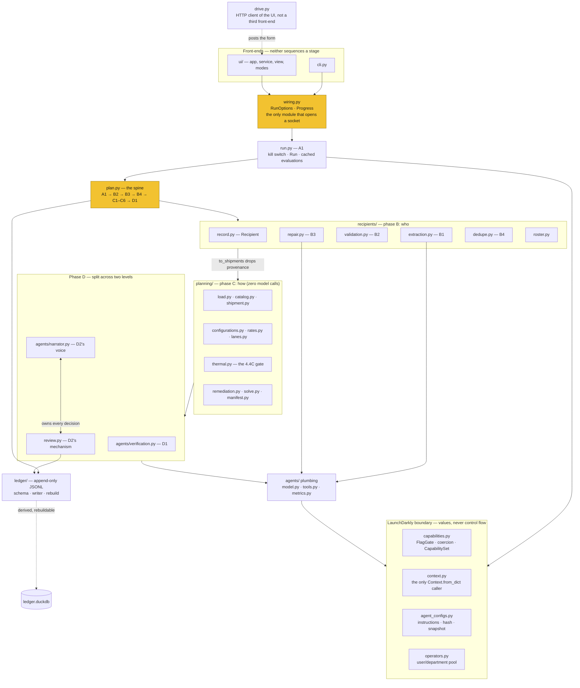

# Module map

What each module in `src/bbq_shipment_agent/` is for. Stage labels (A1, B2, C5…)
refer to the pipeline in [design.md](design.md) section 4.

## How the package is arranged

The flowchart in design.md section 4 is the *pipeline* — the stage sequence.
This is the *code*, which is arranged differently, and the differences are the
part worth knowing.

Four things the diagram is meant to make visible:

- **Both front-ends funnel through `wiring.py`**, which is the only module that
  constructs anything opening a socket. That is what stops an offline fallback
  or a cache path drifting between the CLI and the browser, and it is why no
  test can open a socket by importing something. `drive.py` sits outside it: it
  is a *client* of the UI, posts the form, and builds no `RunOptions` at all.
- **`to_shipments` is a real seam, not a convention.** Phase B works on
  `Recipient`, which carries B1's provenance pointer and confidence; phase C
  gets `Shipment`, which does not. A planning stage cannot re-read a screenshot
  because it is not holding one.
- **Phase D is split across two levels**, and the diagram does not hide it.
  `agents/` means two things at once — model plumbing *and* two stages — while
  `review.py` sits at the package root, away from the narrator that speaks for
  it. Design 10 records this as an open question; a `review/` package holding
  `verification`, `narrator` and `session` would match how B and C read.
- **The ledger is the source of truth and DuckDB hangs off it**, dashed,
  derived, rebuildable, and never written as source of truth.

## Root

| Module | Purpose |
|---|---|
| `__init__.py` | Package entry point. Exposes `main` for the `bbq-shipment-agent` console script. |
| `cli.py` | The command line front-end: `ledger verify\|rebuild\|tools`, `run init\|plan\|extract\|review`, plus `ui` and `drive`. It builds a `RunOptions` and calls `wiring`, so it sequences no stage itself. |
| `wiring.py` | The only module that constructs anything which opens a socket — LD client, Shippo quoter, Anthropic model. Both front-ends assemble their live or replayed paths here, so an offline fallback or cache path cannot drift between them. |
| `run.py` | A1: mint a run ID, evaluate the kill switch, build the `ContextBuilder`, and open the run record with `started_at` and `profile`. Holds the `Run`, which evaluates each capability live through its gate when the reading stage runs and caches the first answer, and the LD client bootstrap. A1 no longer resolves capabilities — the folded snapshot lands on the run row at planning time. |
| `capabilities.py` | The capability enums, the `CAPABILITIES` registry (name → flag key → enum → stage → default), the `FlagGate` seam (`LaunchDarklyGate` online, `OfflineGate` offline), `evaluate_capability` / `evaluate_kill_switch`, the value coercion, and `CapabilitySet`. LaunchDarkly is the sole source of the values; there is no committed capability config, no profile bundle and no prerequisite layer. A served value that is not an enum member is discarded for the default and its rejection reason recorded. Every capability here is read by a stage — `authority` and `memory` were removed for gating nothing (design 6.5). |
| `context.py` | The only place a LaunchDarkly evaluation context is built (`run`, `stage`, `image` and `user` kinds), and the only caller of `Context.from_dict`. Attributes are declared per kind in `_ATTRIBUTES` and an undeclared one is refused rather than forwarded, because a context is sent to LD's servers. |
| `operators.py` | `OperatorPool`: the only source of a user/department pair, read from `config/operators.yaml`. The CLI, the form and the driver all name a *key* and get the pair back; an unknown key is an error and a department is never an input, so two front-ends cannot leave a `department is "kitchen"` rule describing whatever was typed last. |
| `drive.py` | `bbq-shipment-agent drive`: an HTTP client that posts runs at a serving `ui` on an interval, varying the screenshot subset and the operator. Live testing rather than a pipeline path — it builds no `RunOptions` and touches no stage, which is what keeps "two front-ends" true. `HttpTransport` is the only socket it opens. |
| `agent_configs.py` | Retrieves the four LD-configured stages' instructions and model parameters at A1, hashes the *un-rendered* template, and writes the run-start snapshot to `config/ld-snapshot.json`. That snapshot is both the audit trail and the offline instruction cache. A variation the canonical entry does not hold is archived under `agent-key#variation-key`, so every `instruction_hash` in the ledger has bytes committed in the repo; the offline reader looks up bare agent keys only, and so can never serve one back. |
| `hashing.py` | One hashing convention — algorithm, encoding and truncation — shared by the flag payload and the instruction template. Everything that hashes routes through here so hashes recorded months apart still compare. |
| `plan.py` | The spine wired end to end: A1 → B2 → B3 → B4 → C1–C6 → D1. Every stage existed before this module; none had a caller. |
| `review.py` | D2's mechanism: edit handling, the re-solve and pair comparison, and the terminal states (approved, approved with exclusions, rejected). Owns every decision in the review; `agents/narrator.py` is only its voice. |

## `ledger/` — the append-only source of truth

| Module | Purpose |
|---|---|
| `__init__.py` | Re-exports the record types, writer and rebuild entry points. |
| `schema.py` | The four record streams — run, shipment, agent invocation, capability evaluation — one JSONL file each, with their DuckDB column types. A line is a partial update keyed by a merge key, not a row; agent invocations and capability evaluations are events and have no merge key. |
| `writer.py` | Appends JSONL records and assigns the per-file monotonic `seq` a query can order by. Never edits or deletes a line, and rejects naive datetimes rather than assuming a zone. |
| `rebuild.py` | Rebuilds the derived DuckDB cache from the JSONL, dropping it in full every time. An incremental rebuild would let the database hold state the JSONL does not, at which point it has stopped being derived. |

## `recipients/` — phase B, deciding *who* is shipped to

| Module | Purpose |
|---|---|
| `__init__.py` | Phase B's public surface. |
| `record.py` | `Recipient`, phase B's unit, carrying the address plus B1's provenance pointer and confidence. `to_shipments` converts to phase C's `Shipment` at the end of B4 and drops both, so a downstream stage cannot re-read a screenshot because it is not holding one. |
| `roster.py` | Parses `recipients.yaml`, the run input: who is being shipped to, from where, and on which dates. A file rather than CLI arguments because ~22 recipients with optional lane and date pins is not something anyone types, and a file diffs between runs. |
| `extraction.py` | B1: screenshots in, structured recipient records out, via one vision call per image. Not an agent — no loop and no tools — but its model and instructions come from LaunchDarkly, and it records one invocation per image keyed on the image's content hash. |
| `validation.py` | B2: each address through Shippo validation, with a three-way outcome of clean, correctable or failed. `validation-mode` decides who adjudicates a correctable one; advisory messages on clean addresses are kept and surfaced on the manifest. |
| `repair.py` | B3: the first tool-using agent, run only on the correctable and failed set. It re-reads the source image region, proposes a correction and re-validates through Shippo within a bounded budget; what it read is reported separately from what it proposes, and escalation is a normal successful outcome. |
| `dedupe.py` | B4: within-run duplicates, then same-address consolidation, with an explicit suppression reason for everyone excluded. Reads no ledger and no clock, so the same recipient list always produces the same eligible set. |

## `planning/` — phase C, deciding *how*

Zero model calls. Every decision here is ordinary Python.

| Module | Purpose |
|---|---|
| `__init__.py` | The deterministic planning spine's public surface. |
| `catalog.py` | The physical and carrier domain we own: two box sizes, six enumerated gel pack counts (`MIN_GEL_PACKS` 1 through `MAX_GEL_PACKS` 6 — the floor is presentation, not physics), the three ship days, and `MAX_CARRIERS_PER_RUN`. Small enough to enumerate exhaustively, which is what removes the need for a solver. |
| `shipment.py` | `Shipment`, phase C's input unit — recipient, validated address, lane and any required ship date. A plain frozen dataclass, because planning runs entirely in memory and only the chosen plan is written. |
| `load.py` | C1: packet contents to weight and dimensions per shipment, currently uniform. Holds the product mass, initial temperature and specific heat the thermal model reads. |
| `configurations.py` | C2: the cross product of gel pack count, ship date and carrier service, in the smallest box the load fits. Box size is a fit check rather than an axis, because the larger box is dominated on cost and thermal margin at once. |
| `rates.py` | The Shippo seam: what services exist for a parcel on a lane and what they cost. A protocol with live, cached and recorded implementations, so a test can quote without a network call. |
| `lanes.py` | Ambient temperature per destination band and month, read from `config/lanes.yaml`. Stated assumption rather than measurement, and an unmapped state deliberately takes the hottest band so an unstated assumption is never the optimistic one. |
| `thermal.py` | C3: the 4.4C arrival gate and the lumped-capacitance model behind it. The threshold is a Python constant and a permission-level constraint, not a model parameter — it does not move when the model changes. |
| `remediation.py` | C4: what to do where C3 left a shipment with nothing feasible under any carrier — defer to a cooler month, or declare it undeliverable. Ordinary Python, not an agent, because splitting turned out to be physically impossible and what remained is arithmetic. |
| `solve.py` | C5: brute force over the six carrier pairs, assigning each shipment its cheapest feasible configuration. Computes total cost, coverage, the stranded list, whether a Saturday requirement forced the pair, and the minimum thermal margin. |
| `manifest.py` | C6: the top-ranked plan in full, grouped by ship date because that is the shape of the physical work. Carries the runner-up comparison, the suppression and escalation lists, and every field D2's narration is asked to make a claim about. |

## `agents/` — the model-call plumbing, and two stages

| Module | Purpose |
|---|---|
| `__init__.py` | The agents package surface. |
| `model.py` | The seam a model call sits behind, plus the Anthropic implementation and a recorded one for replay. Drops a model parameter the provider refuses, retries once, and reports it on `Completion.dropped_parameters`. |
| `tools.py` | The tool contract and registry: what each agent is allowed to do, and the A1 startup check that an agent's declared tools are ones Python actually offers. LD decides what an agent is told; this decides what it can do. |
| `metrics.py` | Reports five metrics per invocation to LaunchDarkly through the SDK tracker — tokens, duration, time to first token, tool calls, success/error — for per-variation attribution. Duration covers the whole invocation, tool round trips included, because that is what the operator waits for. Success is a property of the invocation, not the manifest: an agent reporting six blockers succeeded. A replayed completion reports no first-token time rather than zero. |
| `verification.py` | D1: a read-only critique of the manifest before a human sees it, gated by `verification-enabled`. Off is a normal run, not a degraded one. |
| `narrator.py` | D2's voice: drives `review-narrator`, runs whatever tools it calls, and hands the answers back to `review.py`. Every claim it makes must trace to a computed field on the manifest, because it explains the C5 solve and does not participate in it. |

## `ui/` — the local web front-end

Binds `127.0.0.1` with no host flag and no authentication, because it serves real
home addresses and screenshots of private messages.

| Module | Purpose |
|---|---|
| `__init__.py` | Exposes `create_app`. |
| `app.py` | The routes: pick screenshots, start a run, watch it, read the manifest, then hold the D2 review — `/runs/{id}/review/*` carries the operator's move to `ReviewSession` and streams the narrator's reply over SSE. Approval writes the ledger from the browser. Goes through `wiring` exactly as the CLI does, and the form configures a run rather than the system: no control for the threshold, the carrier cap, the kill switch or the ledger path. |
| `service.py` | Runs a plan on a worker thread and emits the same stage events the CLI prints, because a browser request cannot block for minutes. One run at a time, refused rather than queued — and a parked review holds the slot until it reaches a terminal state, so a second run cannot append to the same ledger underneath it. |
| `view.py` | Turns a `PlanResult` into the plain dictionaries a template renders, so no template reaches into the pipeline's shape. Keeps its row model the same as `ReviewSession.manifest`. |
| `modes.py` | One sentence per capability *value* describing what that value does to the stage reading it, so the page shows plain language rather than a bare enum. Keyed on the value, not on a profile, because which values a profile produces is LaunchDarkly's to decide. Restates the enum docstrings in `capabilities.py` in one place so the UI cannot invent a second description that drifts. |

## Keeping this current

There is a second copy of roughly this map in the Layout section of
[`CLAUDE.md`](../CLAUDE.md), maintained by hand and able to drift
independently. This refresh had to reconcile both, which is the second time
that has been needed — worth considering whether one of them should become a
pointer at the other.

The drift this pass corrected, for whoever checks next: three modules missing
outright (`operators.py`, `drive.py`, `ui/modes.py`); `capabilities.py`
described as loading a `config/capabilities.yaml` that no longer exists and
resolving profiles and prerequisites that no longer happen; the kill switch
described as repo config rather than an LD flag; `run.py` described as
resolving capabilities at A1; three ledger streams where there are four; the
`user` context kind absent; the CLI missing `ledger tools`, `run extract` and
`drive`; the UI missing the whole D2 review; and seven enumerated gel pack
counts where the code enumerates six.

Every claim above was checked against the code rather than against the
previous version of this file.
