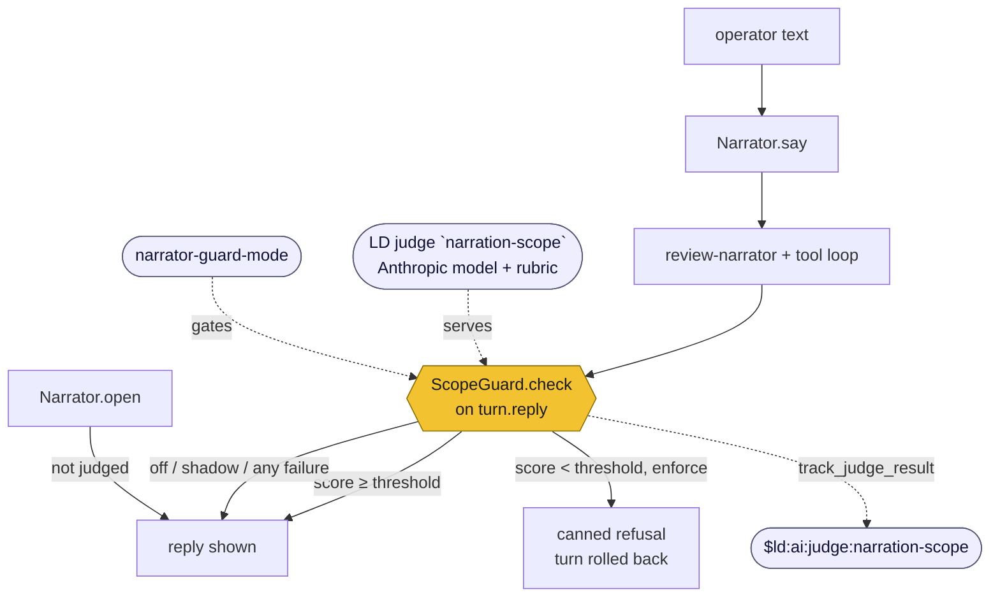

# Plan: suppress out-of-scope narrator responses with a LaunchDarkly judge

Status: proposed
Branch: `docs-narrator-scope-guard-plan`

## Context

`review-narrator` is the one conversational surface in the system, and nothing
stands between an operator's free text and the model — or between the model's
reply and the operator:

| Entry point | Where | What it does |
|---|---|---|
| UI, sync | `ui/app.py:361-371` | `review_say(message=Form(...))` → `narrator.say(message)` |
| UI, SSE | `ui/app.py:374-413` | same, with `on_delta` streaming to the browser |
| CLI | `cli.py:552,584-585` | anything not a recognised verb → `narrator.say(said)` |

The served instructions (`config/ld-snapshot.json:29`) have detailed rules on
faithfulness and authority and **no clause at all** about a message that has
nothing to do with shipping. Ask it a leetcode problem and it answers one.

The requirement is that an out-of-scope **response** never reaches the operator.
That is deliberately stronger than refusing out-of-scope questions: an in-scope
question can still produce a wandering answer, and only checking the output
catches both.

Scope is **this run's manifest only**. The threat model is scope discipline and
demonstrability — explicitly *not* prompt injection and *not* content
moderation.

## The LaunchDarkly mechanism

AgentControl's evaluation primitive is the **judge**: a config with its own
model, its own scoring rubric, and an `evaluationMetricKey`, returning
`{score: 0.0–1.0, reasoning}`. Judging an output is its native use — which is
what makes an output-side guard the natural fit rather than a workaround.

Four documented facts fix the design:

1. **Blocking is a supported pattern.** The judges page says to "use judge
   scores in your application's execution logic to enforce custom guardrails at
   runtime, when the evaluation sampling rate is set to 100%". Judges score; the
   application blocks.
2. **Judges can be invoked programmatically** on arbitrary input/output pairs,
   unattached to any variation.
3. **Attached judges only work in completion mode.** Every config here is Agent
   mode, so programmatic invocation is required, not preferred.
4. **Judges run in your process against your own credentials** — "LaunchDarkly
   does not proxy or independently invoke model providers."

### How the judge is executed — the documented pattern, not a deviation

Fetch the config from LaunchDarkly, call the model yourself, track through the
tracker LD mints. That is **LaunchDarkly's primary documented integration**, not
a workaround, and it is what this repo already does on all four stages.

Their getting-started guide for OpenAI — their flagship provider, the one that
*has* a first-party runner package — teaches exactly this shape:

```python
config  = ai_client.completion_config(key, context)     # LD serves model + prompt
tracker = config.create_tracker()                       # LD mints the tracker
openai_client.chat.completions.create(                  # you call the provider
    model=config.model.name, messages=chat_messages, **params,
)                                                       # wrapped in track_metrics_of(...)
```

with the guide stating plainly that no managed model runner or intermediary
layer is involved. The Anthropic guide says the same thing in the same place.

So the judge does what every other stage here does: `judge_config()` for the
model, rubric and `evaluationMetricKey`; `AnthropicModel` for the call;
`track_judge_result` for the score.

**Two corrections worth recording**, because both were got wrong while writing
this plan and a future reader will hit them again:

- **AI Configs and the runner abstraction are different things.** AI Configs
  place no limit on the request you build — vision, streaming, tool loops and
  multi-turn all work, which is why B1 sends screenshots and D2 streams today.
  The string-only surface is `Runner.run(input: str)`
  (`langchain_model_runner.py:62` wraps it in a single `HumanMessage`), which is
  the optional execution layer. "The SDK can't do vision" is false; "the runner
  is string-in" is true and much narrower.
- **Using `create_tracker` *is* the documented pattern.** Design 10's warning
  that hand-reimplementing it cost two live bugs is a warning against bypassing
  the helper, not against calling the provider directly. This design uses the
  helper.

### The optional runner layer, and why it stays unused

`ManagedModel` / `ManagedAgent` / `create_judge` would additionally execute the
call, extract metrics, and auto-dispatch judges. Adopting it is a real option
for a judge — single-shot, untooled, text-only is exactly its shape — and it is
declined on three narrow grounds:

- **It cannot serve most of this pipeline.** `Runner.run` is string-in with no
  streaming anywhere in `ldai` or the langchain provider, so B1 (base64
  screenshots) and D2 (token-by-token SSE) cannot use it. Adopting it only for
  the judge would create a second invocation path in a codebase whose central
  claim is single seams.
- **It needs a dependency chain** — `launchdarkly-server-sdk-ai-langchain` plus
  `langchain-anthropic` — for one scoring call per turn.
- **It would open a socket outside `wiring.py`**, which is what makes "no test
  can open a socket" true, and it removes the `RecordedModel` replay path the
  guard's fixtures want.

What that costs us is small and bounded: the prompt framing, the structured
parse, and the 0.0–1.0 clamp that `Judge.evaluate` would otherwise do. Mirror
the SDK's own framing (`MESSAGE HISTORY: … RESPONSE TO EVALUATE: …`,
`judge/__init__.py:169`) so a console-authored rubric behaves identically and
adopting the runner later stays a drop-in.

Mitigate it by mirroring the SDK's own prompt framing
(`MESSAGE HISTORY: … RESPONSE TO EVALUATE: …`, `judge/__init__.py:169`) so a
rubric authored in the console behaves identically under either path, and
switching to Path A later is a drop-in rather than a re-tune.



## Design

### `guard` is a standalone capability, outside the fingerprint fold

**The load-bearing decision.** Adding `guard` to `CAPABILITIES` and
`CapabilitySet` fails *silently*: `resolved_capabilities()` (`run.py:186-195`)
returns `None` until every registered capability is cached, and
`cap_fingerprint` / `cap_snapshot` / `flag_payload` are written at planning
(`plan.py:324`). A capability read at D2 is evaluated long after that, so every
run row would quietly lose its snapshot — no exception, just nulls.

Pre-evaluating during planning to dodge that is worse: it evaluates a D2
conversation dial on `run plan` invocations that never reach D2, writing a
`capability_evaluations` line for a stage that provably never ran — the failure
design 6.6 records as **fixed**. It would also re-partition `cap_fingerprint`
for every run, so a **shipment row's** fingerprint would move because the
chatbot got a scope guard.

`capabilities.py:186-192` states the precedent: the kill switch "is not in
`CAPABILITIES`". The distinguishing property is not enum-ness — it is being
evaluated **outside the planning fold**.

```python
GUARD = Capability("guard", "narrator-guard-mode", GuardMode,
                   STAGE_REVIEW_GUARD, GuardMode.OFF)   # NOT in CAPABILITIES
```

`GuardMode` is `off` / `shadow` / `enforce`. `shadow` scores and records without
suppressing, which is how the threshold gets set from real data rather than a
guess — the same promotion mechanism `PlannerMode.SHADOW` provides.

Consequence to write down in design 7: `guard` appears on
`capability_evaluations` but not in `cap_snapshot`. `_cap_reasons` folds into
`evaluation_reasons` at planning, before the guard runs, so its reason is
appended in `review.py:_close` (`review.py:589-613`) beside `review_edits`.

### Where the judge runs

**After the tool loop, on `turn.reply`** — the assembled final text, which is
what the operator would see. Not per tool-loop iteration: intermediate
completions are the model working, not its answer, and `turn.reply` is only set
by the loop's exit branch (`narrator.py:176`).

Two things are deliberately **not** judged:

- **`open()`.** The opening narration is Python-prompted (`OPENING_PROMPT`,
  `narrator.py:56-61`) and in scope by construction; suppressing it would leave
  the review with no opening at all. So the body of `say` becomes `_say`,
  `open()` calls `_say(OPENING_PROMPT)`, and the new `say` is `_say → judge`.
- **The iteration-exhaustion reply** (`narrator.py:187-190`). That string is
  Python's, not the model's.

### Enforcing means giving up streaming

`ui/app.py:374-445` and `run.html:456-518` paint tokens into a visible bubble as
they arrive. A response that must be judged before the operator sees it cannot
already be on their screen. So under `enforce`:

- `say` does **not** forward `on_delta` to `converse`;
- the review pane posts to `/review/say` rather than `/review/say-stream`.

`run.html:545-553` already falls back to `submitSync` on any stream error, so
the sync path exists and is exercised. Streaming survives untouched under `off`
and `shadow` — the modes where nothing is withheld.

This is a real product cost and a **design-doc-level change**: design 10 states
that the narrator "streams its reply token by token over SSE". That sentence
needs a clause about the enforcing case.

### What a suppressed turn does

The narrator **did** run, so unlike a skipped stage it is fully recorded
(CLAUDE.md: "an invocation that *ran* is always recorded"). Three consequences:

- **The `review-narrator` invocation record is written**, with `outcome`
  `suppressed`. `metrics_for` stays exactly where it is at `narrator.py:137` —
  the invocation genuinely happened and its duration and tokens are real.
- **The judge writes its own invocation record**, with the score.
- **The whole turn is rolled back from `self.messages`** — both the operator's
  message and the suppressed assistant reply. With no input-side gate, the
  prompt may itself be the off-topic question; keeping it would re-prime the
  model on the next turn, suppress again, and loop invisibly. Truncate back to
  the pre-turn length.

The refused `Turn` is appended to `self.turns` so the operator sees the exchange
and the refusal. `turns[0]` is still the opening (`view.py:297`), because
`open()` bypasses the judge. The canned refusal is a **Python constant** — a
refusal the model composes is one it can be talked out of.

### Fails open, always

`Judge.evaluate` never raises; it catches everything and returns a `JudgeResult`
carrying `error_message`. We keep that property: an unavailable judge config, a
model error, an unparseable reply, or a score outside 0.0–1.0 all let the
response **through**, with the reason recorded. A guard outage must not blank
out a review.

## Files to change

### New — `src/bbq_shipment_agent/agents/guard.py`

`ScopeGuard`, holding `JUDGE_KEY = "narration-scope"`, `REFUSAL`, `THRESHOLD`,
and `check(prompt, reply) -> Verdict`.

- Fetches `LDAIClient.judge_config(...)` for the model, rendered messages and
  metric key, and adapts the returned `AIJudgeConfig` into the repo's
  `AgentConfig` shape so `metrics_for`, `Invocation.from_config` and
  `record_agent_invocation` all work unchanged.
- `Invocation.from_config` **raises** when a config is unavailable or names no
  model (`model.py:118-128`) — catch it and degrade to a no-op guard. Both
  front-ends wrap `Narrator` construction in
  `except (NarratorUnavailable, ModelUnavailable)`, so an uncaught raise would
  kill the narrator instead of the guard.
- Calls `ModelClient.complete` (`model.py:158-161`) — single shot. Recent turns
  go in as `message_history`, `turn.reply` as `response_to_evaluate`.
- Parses `{score, reasoning}`, clamps to 0.0–1.0 (the SDK discards anything
  outside), compares against `THRESHOLD`.
- Reports with `tracker.track_judge_result(...)`, which is duck-typed
  (`tracker.py:392`), so a constructed `JudgeResult(judge_config_key=…,
  metric_key=…, score=…, sampled=True, success=True)` lands the score on
  `$ld:ai:judge:narration-scope`. It **no-ops unless `sampled` is True** — set
  it explicitly; this is the 100%-sampled blocking guard the docs describe.
- Records its invocation with **four fixed outcomes**: `in_scope`,
  `out_of_scope`, `unparsed`, `error`. The last two behave as in-scope.
  `record_agent_invocation` takes an explicit `config=` argument
  (`run.py:397-409`) — needed here, because a judge is not in
  `run.agent_configs` and the default identity lookup would find nothing.
- `tools_offered` / `tools_called` are **omitted, not `[]`** — design 7 makes
  absent mean "this append knows nothing" and empty a measurement; the judge has
  no tool loop, like B1 and D1.

**The threshold is a Python constant**, not a served value: a threshold is
control flow, and design 6.1 keeps control flow in Python. The mode, the model
and the rubric are LaunchDarkly's.

**Model-authored text must never reach the ledger.** The judge's `reasoning`
goes to the screen and to LaunchDarkly, never into `agent_invocations` —
CLAUDE.md's secrets rule requires a recorded value be structurally incapable of
carrying free text. The **score** is safe: a bounded float. Add a nullable
`judge_score DOUBLE` to `AgentInvocationRecord` (`ledger/schema.py:266-321`) so
a run stays diagnosable from committed JSONL alone; a nullable column needs no
`SCHEMA_VERSION` bump.

### Modified

| File | Change |
|---|---|
| `capabilities.py:58-86` | Add `class GuardMode(StrEnum)` |
| `capabilities.py` (module level) | Add the `GUARD` descriptor — **not** in `CAPABILITIES` |
| `context.py:61-67` | Add `STAGE_REVIEW_GUARD = "review_guard"`; no `_ATTRIBUTES` change, `stage` is key-only |
| `run.py:146-172` | Generalise `_evaluate` to take a `Capability` descriptor |
| `run.py:174-184` | Add `def guard(self) -> GuardMode` |
| `agent_configs.py` | Add judge retrieval (`judge_config`, `judge_config_template`) and extend the snapshot — see below |
| `agents/narrator.py:120-202` | `say` → `_say`; new `say` = `_say` + judge + suppression/rollback; `open()` calls `_say`; `Turn` gains `refused: bool = False`; new **keyword-only** `guard=None` param; `on_delta` withheld when enforcing |
| `wiring.py` | Add `guard_model(options, mode)` beside `verifier` (`:601`) and `narrator_for(...)` |
| `cli.py:529-540`, `ui/service.py:415-421` | Replace both `Narrator(...)` constructions with `wiring.narrator_for(...)` |
| `ui/service.py:99,220,259` | `RunService(conversing_model=)` → `narrator_factory=` |
| `ui/app.py:374-445`, `ui/templates/_review_pane.html:76-81` | Post to the sync route when enforcing (drop `data-stream`) |
| `ui/view.py:298-301` | Carry `refused` into the transcript dict |
| `ui/templates/_review_pane.html:66-72` | Render a suppressed bubble with a distinct label/class |
| `ledger/schema.py:266-321` | Nullable `judge_score` |

Note what is **not** needed: no `LD_CONFIGURED_STAGES` entry, no `TOOL_NAMES`
entry, no `assert_tool_contract` interaction. A judge is not an agent config and
is not fetched through `variation_detail`, so
`tests/test_agent_configs.py:488-516` is untouched, as is `ui/modes.py` (`guard`
is not in `CAPABILITIES`).

### Extending the snapshot to judges

`judge_config_template(key, context)` returns the **un-rendered** messages with
`{{message_history}}` and `{{response_to_evaluate}}` preserved — precisely what
design 6.4 mitigations 2 and 3 need. So the rubric is hashable and committable
exactly like the four agent configs, and the audit trail holds for the stage
that decides whether an operator sees an answer at all.

Add a `"judges"` section to `config/ld-snapshot.json` beside `"agents"` and
generalise `snapshot_document` / `write_snapshot` (`agent_configs.py:495-520`).
This bumps `SNAPSHOT_SCHEMA_VERSION` to 2 — the committed file must be
regenerated in the same change, or `SNAPSHOT_SCHEMA_MISMATCH` disables all four
existing agent configs too. **This is the one change that does not degrade
quietly.**

### The single construction seam

`wiring.narrator_for(run, session, *, options, ledger_root) -> Narrator | None`
builds the conversing model, the guard and the `Narrator`; both front-ends call
it. This also fixes duplication that predates the change — `Narrator`
construction is copied across `cli.py:533-538` and `ui/service.py:415-421`, and
`cli.py:508-514` records this repo being bitten once already when "the seam the
CLI actually uses was the one thing not covered."

`guard_model(options, mode)` mirrors `verifier` (`wiring.py:601-607`), putting
the off short-circuit in the factory. It **returns `None`, never raises**:
`conversing_model` raises `ModelUnavailable` to request the button-driven
fallback, so a raising guard factory would silently kill the narrator.
`ScopeGuard` must never construct `AnthropicModel()` itself — `wiring.py` stays
the only module that opens a socket.

## Cost and latency

Two model calls per turn instead of one, and the judge is serial — it cannot
start until the narration is complete, and under `enforce` the operator sees
nothing until it finishes. Roughly doubles perceived turn latency, on top of
losing streaming.

Levers, in order:

1. A cheap Anthropic model on the judge config (`manifest-verification` is
   already on `claude-haiku-4-5-20251001`) and a low `max_tokens` —
   `model.py:38-40` defaults to 4096, a wasted ceiling for a rubric returning a
   number.
2. `run.guard() is GuardMode.OFF` short-circuits in the factory, so an
   off run makes zero judge calls and evaluates the flag once per **run**, not
   per turn.
3. A dead judge config is cached on the `ScopeGuard` so the reason is recorded
   once, not per turn.

Do **not** run the judge concurrently with the narration — it has nothing to
score until the narration exists. Do **not** judge partial output mid-stream: a
refusal after the operator has already read half the answer is worse than no
guard.

The judge's latency lands in its own tracker, so `review-narrator`'s duration
stays honest but no longer equals what the operator waited for; design 8 defines
duration as what the operator waits for, so this belongs in a docstring rather
than being discovered from two disagreeing charts. The UI's `turn_lock`
(`app.py:341,395`) is now held across both calls, widening the concurrent-turn
409 window.

## The real risk: false positives

A judge that scores a legitimate narration low suppresses a correct answer, and
in `enforce` the operator has no override and no way to see why. That is worse
than the leetcode answer it exists to prevent.

1. Pass the recent turns as `message_history` so the answer is judged **in
   context** — a terse reply to "why?" is in scope only if the judge can see
   what was asked. This is what the input/output pair is for.
2. The rubric must treat the manifest's own vocabulary — carriers, margins,
   gel packs, ship dates, escalations — as in scope by default.
3. Bias toward in-scope on anything ambiguous.
4. **Ship at `shadow`**, read the score distribution off
   `$ld:ai:judge:narration-scope`, and set `THRESHOLD` from real data before
   anyone enables `enforce`.

## LaunchDarkly console work

1. Confirm Anthropic is connected as an organisation provider.
2. Judge config **`narration-scope`**: Anthropic model, 0.0–1.0 rubric scoring
   whether the response stays within this shipping review,
   `evaluationMetricKey` = `$ld:ai:judge:narration-scope`, direction so higher =
   more in scope. **The metric key is not optional** — `Judge.evaluate` returns
   early without it and `track_judge_result` no-ops without it.
3. Flag **`narrator-guard-mode`**, variations spelled exactly `off`, `shadow`,
   `enforce`. A mismatch degrades to the default and records
   `FLAG_VALUE_INVALID:<value>` rather than failing the run.
4. One live `run init` to regenerate and commit `config/ld-snapshot.json`.

## Documentation to update

design 6.1 (ownership table; the guardrail pattern is judge score + application
logic), 6.2/6.3 (a judge, not an agent; deliberately not in
`LD_CONFIGURED_STAGES`), 6.4 (snapshot covers judges), 6.6 (`review_guard` stage
kind), 6.8 (taxonomy row — operational, permanent), 7 (`guard` outside the
snapshot fold; `judge_score`), 8 (**required**: section 8 says a flag that moves
no metric should be turned off — this one moves out-of-scope responses reaching
the operator, a *per-turn* metric, which section 8 notes reaches significance
far sooner than the per-run flags), 10 (the streaming claim now has an
enforcing-mode exception; and this builds most of the
`narration-faithfulness` plumbing — that judge becomes a second config rather
than new machinery, scoring faithfulness where this one scores scope).
CLAUDE.md: capability rules, snapshot description, layout.

## Verification

- `uv run pytest` — including new tests: `open()` is never judged; an enforced
  suppression returns the canned refusal; `off` never invokes the judge;
  `shadow` scores and records but still shows the reply; `enforce` writes one
  judge record **and** a `review-narrator` record with `outcome='suppressed'`;
  `self.messages` is byte-identical to its pre-turn state after a suppression;
  unavailable/model-less/raising/unparseable/out-of-range all pass through with
  distinct outcomes; `track_judge_result` called with `sampled=True`; the
  judge's `reasoning` appears in no ledger record; `on_delta` is not forwarded
  when enforcing; snapshot round-trip for a judge entry.
- Guard tests inject a synthetic judge config and a scripted `ModelClient`
  (`ScriptedModel`, `test_narrator.py:33-46`). A fake rubric string in a test is
  not a CLAUDE.md violation — that rule targets a second copy of the *served*
  text, and the repo already does this at `test_agent_configs.py:26,211,439`.
- `uv run bbq-shipment-agent ui`, flag at `enforce`, run to `awaiting_review`:
  an in-scope question is narrated (no streaming — the reply appears whole); a
  leetcode question produces the canned refusal, visibly not attributed to the
  narrator; a terse follow-up ("why?") is **not** suppressed; asking the
  leetcode question twice does not loop, and the second in-scope question shows
  no awareness of either suppressed exchange.
- Set the flag to `shadow` and confirm streaming returns.
- `ledger rebuild`, then
  `select agent_key, outcome, judge_score from agent_invocations where run_id = '<id>'`
  — a suppressed turn shows a `narration-scope` row with `outcome='out_of_scope'`
  and a score, beside a `review-narrator` row with `outcome='suppressed'`. Run
  rows still carry a non-null `cap_fingerprint` and a three-capability
  `cap_snapshot`, unchanged by this work. Use `json_extract_string(...)`, not
  `->>`.
- Scores appear on `$ld:ai:judge:narration-scope` in the Monitoring tab. Flip
  the flag between `enforce` and `shadow` **without redeploying** and confirm
  the behaviour changes — that round trip is the whole reason this lives in
  LaunchDarkly.

## Out of scope

- **Prompt injection / data exfiltration.** The payload holds real validated
  home addresses; a topicality judge is not an adversarial defence.
- **Content moderation.** The built-in toxicity judge is available later.
- **An input-side gate.** Judging the response catches both off-topic questions
  and in-scope questions that produced wandering answers, so a second judge in
  front of the narrator would add a third model call per turn to save a Sonnet
  call on the minority of turns. Revisit if the cost of narrating answers that
  are then discarded proves material.
- **`narration-faithfulness`** (design 10) — this builds its plumbing, not the
  config.
- **CLI verb dispatch.** `approve`/`reject`/`pin`/`exclude` are intercepted at
  `cli.py:559-587` before the narrator, so no narration is produced and there is
  nothing to judge. Correct as-is.
