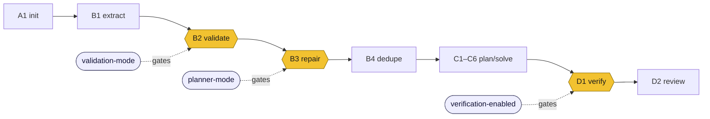

# Plan: make the web UI reflect the three run modes

Status: implemented
Branch: `claude/ui-modes-clarity-xz3x2a`

## Context

The system has three capability modes, each gating exactly one pipeline stage:

| Mode | LD flag | Values | Stage | What the values do |
|---|---|---|---|---|
| **validation** | `validation-mode` | `off` / `standard` / `strict` | B2 | off = ships addresses as supplied; standard = applies corrections, escalates hard failures only; strict = escalates anything not already clean |
| **planner** | `planner-mode` | `off` / `shadow` / `on` | B3 | off = never runs; shadow = runs but repairs logged, not applied; on = repairs + re-validates |
| **verification** | `verification-enabled` | `off` / `on` | D1 | off = manually reviewed; on = D1 self-critiques before the operator sees it |

The web UI surfaced all three only as a raw enum table on the result page,
never rendered the validation mode at all, and offered a profile dropdown that
looked like it configured the run. An operator could not tell, without reading
the code, which mode governs which stage or what a resolved value does — and the
dropdown implied the form set the modes, when LaunchDarkly does.

Goal: the result page names each mode, the stage it gates, and what its resolved
value did on this run, in plain language; and the form stops implying it
configures the modes.

## Mode → component map

Each mode gates one stage of an otherwise deterministic spine. Everything else
runs regardless of mode.

## Design

### `ui/modes.py` (new)
The one place the plain-English effect of each `(mode, value)` pair is written,
alongside the stage it gates and a display tone. It is keyed on the *value* a
stage reads — a code fact, stable whether the value comes from a profile default
or a live LaunchDarkly evaluation. It is deliberately **not** a profile → mode
mapping; which modes a profile produces is LaunchDarkly's to decide, shown
resolved on the run page. A value with no line still renders (raw value + a
generic note) rather than dropping the mode off the page.

### Result page (`ui/view.py`, `ui/templates/run.html`, `ui/templates/base.html`)
`run_header` enriches each capability through `modes.describe(...)`, keeping the
`resolved_capabilities()` guard so the list is empty until planning evaluates it.
The template replaces the raw table with per-mode cards — stage badge, title,
mode name, resolved value (toned tag), effect sentence, and the resolve reason —
while preserving the live-per-stage empty-state, the fingerprint line, and the
kill-switch line. The validation card shows this run's corrected/escalated
counts; the verification card points to the D1 panel. Card styling lives in
`base.html`.

### Form (`ui/templates/index.html`, `ui/app.py`)
The profile dropdown is removed. The profile is only a LaunchDarkly targeting
label — it does not set the modes — so a control that looked like it configured
the run misrepresented it. A browser run carries whatever profile the server was
launched with. The POST endpoint still accepts a `profile` field, because
`drive` posts one per run as its rollout axis; only the human control is gone.

## Reconciliation with the capabilities refactor

This work was first written against the pre-refactor `main`. The
LaunchDarkly-native capabilities refactor then merged (renamed the `run_header`
accessors to `resolved_capabilities()`/`cap_reasons()`/`kill_switch`, made
capabilities resolve live per stage — `None` until planning — deleted
`config/capabilities.yaml`, `CapabilityConfig`, and `RunOptions.config`, and
demoted `profile` to a bare targeting label). The feature was rebased onto it:
`modes.py` and its enum values were unaffected; `run_header` and `run.html` were
re-applied on top of the refactor's shapes; and the earlier config-derived
profile picker was dropped (there is no repo config to enumerate now), which the
subsequent dropdown removal made moot.

## Verification
- `uv run pytest` — full suite green (749 passed).
- Render an offline run via `TestClient`: three mode cards (validation standard,
  planner off, verification off) with stage badges, effect sentences, and the
  LaunchDarkly-targeting footer; an `extract`-depth run shows the "evaluated
  live per stage" empty-state; the form has no profile control, and a POST with
  a `profile` field is still accepted.
